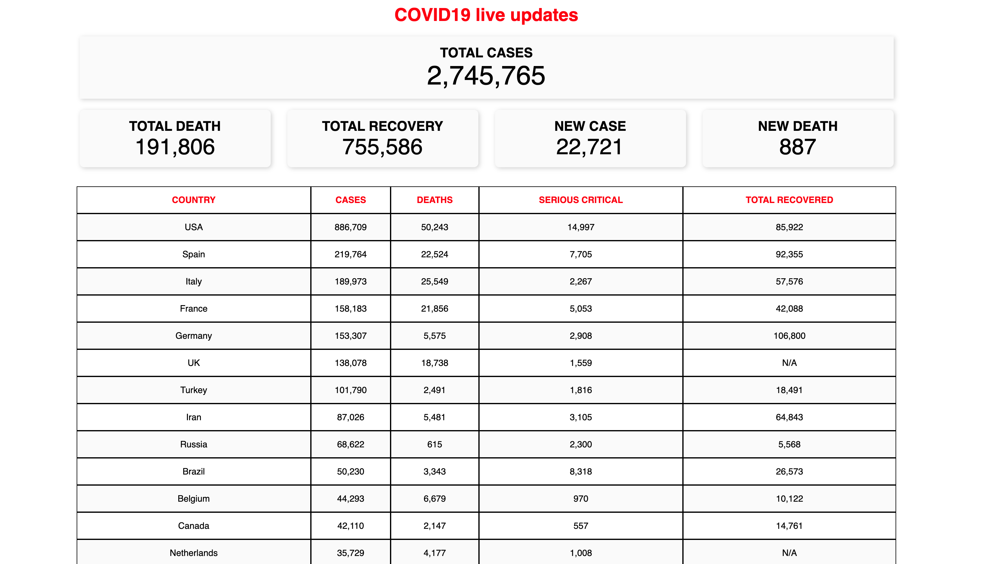

[](https://www.webcomponents.org/element/owner/my-element)

# corona-lit
## A simple covid19 status lit component.

A simple corona status lit component.

## Quick start

```
npm install -g webpack-cli
git clone https://github.com/Eshwar4299/corona-lit
cd corona-lit
npm install
npm run dev
```

## Detailed setup info

* [Clone](#clone-this-repo)
* [Serve](#start-a-dev-server)
* [Setup](#set-up-new-app)
* [Build](#build-for-production-and-serve-locally)

### Clone this repo

```
git clone https://github.com/Eshwar4299/corona-lit
```



### Start a dev server

```
npm install --save-dev webpack webpack-cli webpack-dev-server copy-webpack-plugin html-webpack-plugin
npm install --save-dev @webcomponents/webcomponentsjs
cd corona-lit
npm install
npm run dev
```

```
<custom-element-demo>
  <template>
    <link rel="import" href="my-element.html">
    <link rel="import" href="../src/app/corona-lit.js">
    <next-code-block></next-code-block>
  </template>
</custom-element-demo>
```

```html
<corona-lit></corona-lit>
```
